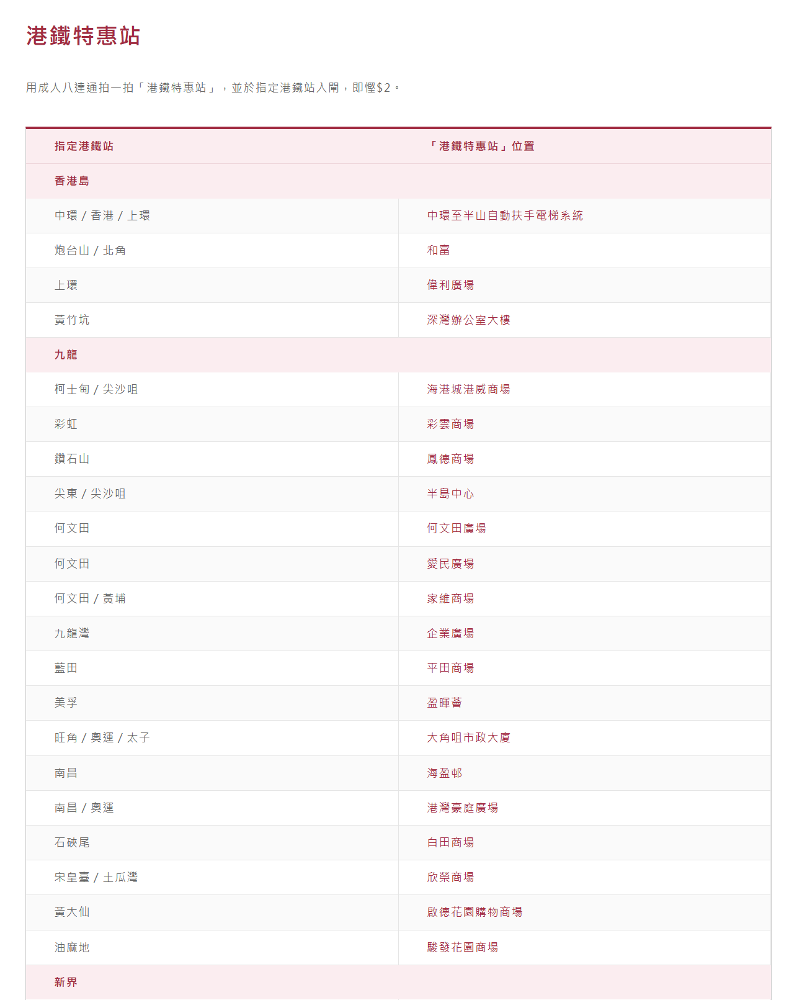

# Tips
## 港鐵特惠站

## 美食篇
### 葵涌广场里的美食区

香港的餐饮给人留下的第一印象便是贵，街边随便来一晚公仔面（其实就是方便面）都要30多港币，还吃不饱！除了麦当劳，香港有没有既便宜又大碗的食肆？

当然有，只不过需要你耐心寻找一下。香港城乡各个街区都有名为“街市”或“熟食中心”的地方，这就是香港普通市民的大食堂。因为有朋友带领，曾经吃遍了西环若干个街市——士美菲路街市的鸡煲，石塘咀街市的川菜等等都令人印象深刻。再到后来，朋友又带我去了葵芳站旁葵涌广场顶楼，才真是叫人大开眼界！冰淇淋，5个球12港币；牛杂，9港币一大杯；酸辣米线一大锅（足够两人吃）只要46港币。
地鐵站：荃灣綫葵芳站
### 赤柱
第一天如果有時間可以去

地鐵：中環A出口+巴士：6X、6、260

赤柱博物館、赤柱郵局、八間屋、赤柱后灘
