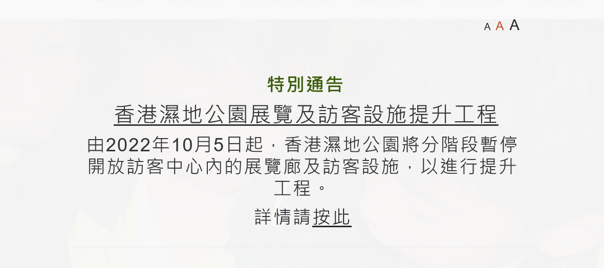

# Tips
## 港鐵特惠站

## 濕地公園通告

## 可能會用到的網站
### [港鐵](https://mtr.com.hk)
### [香港賽馬會](https://racing.hkjc.com/racing/information/Chinese/Racing/Fixture.aspx)
### [中環摩天輪](https://hkow.hk/zh-hans/ticket-info/)
### [香港濕地公園](https://www.wetlandpark.gov.hk/tc/)
# 上網卡
支付寶搜索`境外上网`，推薦買隨身移動WiFi，麻煩是麻煩了點，但是無限流量，租金也便宜。

隨身移動WiFi：`M:/U9Xl6g100b6 或复制此消息打开支付宝，領取出境海岛游玩攻略～  $913 l@T.fCNF 2344688 p:/n`

`Y:/k2mFWxz00cK 或复制此消息打开支付宝，令页取出境海岛游玩攻略～  $955 E@j.JKKw 4265247 K:/M`

`u:/bXfHpnf00r9 或复制此消息打开支付宝，領取出境海岛游玩攻略～  $124 y@l.bLzR 2683911 F:/D`

上網卡：`m:/ttJ1xDE00ou 或复制此消息打开支付宝，令页取出境海岛游玩攻略～  $640 F@r.XLqY 5064168 K:/U`
# 參考資料
[去了100次香港，是这些地方让我一再流连](https://zhuanlan.zhihu.com/p/21753879?utm_campaign=shareopn&utm_medium=social&utm_oi=719659270496337920&utm_psn=1658580436078166018&utm_source=wechat_session)

[干货满满丨第一次去香港超全旅游攻略！!](https://zhuanlan.zhihu.com/p/626478911)